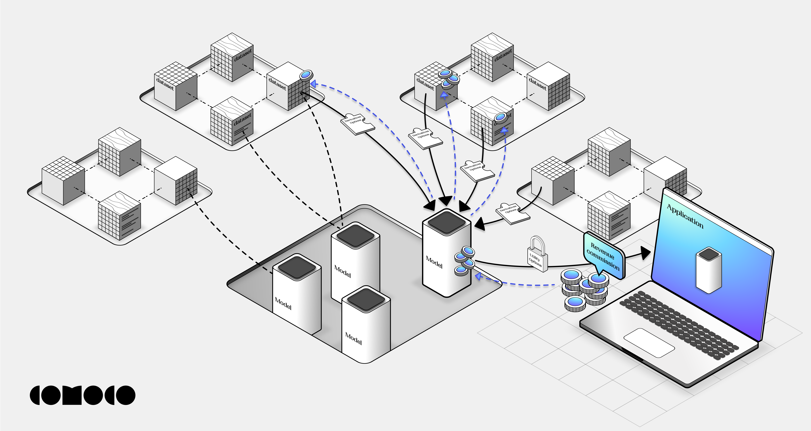

# laicense

## Introduction

With the rapid emergence of AI, debates have arisen regarding the utilization of datasets for training AI models. Specifically, questions have been raised about whether the creators of articles, images, videos, and code should retain ownership rights over their creations and share in the commercial revenues generated by businesses leveraging these AI models. Striking a balance between preserving the evolution of the AI era and imposing upfront payment restrictions is essential. A promising approach involves enabling free use of datasets for research purposes while allowing for revenue sharing opportunities when applicable. This principle should extend to AI models and other API developers as well.

In response to these challenges, we are pleased to introduce **Comoco Laicensor**, an open-source project designed to empower all creators to assign a unique token to their creations within one or multiple datasets. By obtaining a license from a portion or the entirety of a dataset, AI model developers can train their models, which will be recognized as derivative tokens of the licensor dataset. It is worth noting that the licensing terms remain consistent throughout the entire licensor dataset, even if it comprises data elements from multiple authors.

Moreover, AI model developers have the ability to establish licensor agreements for the models they create, enabling application developers to invoke and make payments according to the agreed-upon terms. This integrated system aims to simplify the licensing process for datasets, models, and APIs by leveraging smart contracts, thereby shifting the complexities of negotiation and payment procedures to an open-source solution.

Licensors can utilize **Comoco Laicensor** to construct their own tailored solutions based on the open-source project, or alternatively, they can opt to utilize the comprehensive services provided by Comoco.

## Architecture

## Showcase

We are excited to present a sample showcase that we have developed in-house and are now releasing as an open-source project. This showcase comprises the following components:

1. A facial expression dataset that indexes facial expression images with the 52 Apple ARKit Shapekeys.

2. A smart contract that facilitates the minting of datasets as licensor tokens.

3. Code for training a vision model capable of real-time calculation of Shapekeys.

4. Minting the model API as a derivative token of the licensor dataset token.

5. The derivative token generated by the AI model/API produces utility tokens that can be integrated into applications.

Please find the step-by-step guide in the [tutorial](tutorial.md) document.
